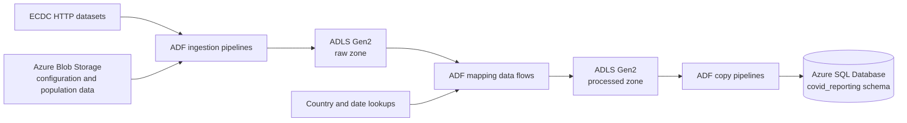
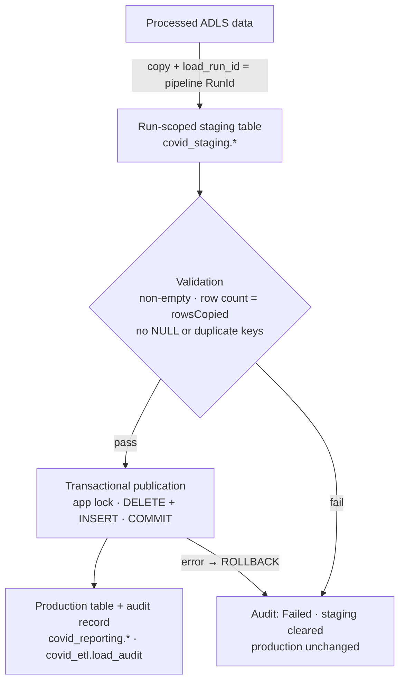

# Azure COVID-19 Data Pipeline

An Azure Data Factory (ADF) project that ingests public COVID-19 and population data, transforms it in Azure Data Lake Storage Gen2, and loads curated datasets into Azure SQL Database.

The repository contains the source-controlled ADF resources and generated ARM templates needed to deploy the factory. It also contains the Azure SQL DDL, stored procedures, and tests for the database side. It does not include source data or cloud credentials. Azure services are accessed with the Data Factory managed identity, so no secrets are required in source control.

## Architecture



## What the project does

- Uses a configuration file in Blob Storage to ingest multiple ECDC datasets over HTTP.
- Validates and copies compressed population data from Blob Storage into ADLS Gen2.
- Transforms cases, deaths, and hospital-admission data with ADF mapping data flows.
- Enriches records with country codes, population data, and calendar dates.
- Produces daily and weekly hospital-admission datasets.
- Loads processed cases and deaths, daily hospital admissions, and testing data into Azure SQL Database.
- Supports both scheduled ECDC ingestion and event-driven population ingestion.

## Data flow

### Ingestion

| Pipeline | Purpose |
| --- | --- |
| `pl_ingest_ecdc_data` | Reads `ecdc_file_list.json`, downloads each configured ECDC CSV over HTTP, and writes it to the ADLS `raw/ecdc` area. |
| `pl_ingest_popuation_data` | Waits for `population_by_age.tsv.gz`, validates its 13-column structure, copies it to `raw/population/population_by_age.tsv`, and deletes the source object after a successful copy. |

### Transformation

| Pipeline | Mapping data flow | Output |
| --- | --- | --- |
| `pl_processed_cases_and_deaths_data` | `df_transform_cases_deaths` | Filters European records, pivots case/death indicators, enriches country codes, and writes `processed/ecdc/cases_deaths`. |
| `pl_processed_hospital_admissions` | `df_transform_hospital_admissions` | Separates daily and weekly measures, joins country and date lookups, pivots occupancy metrics, and writes daily and weekly processed datasets. |

### SQL loading

| Pipeline | Staging table | Published table | Business key |
| --- | --- | --- | --- |
| `pl_sqlize_cases_and_deaths` | `covid_staging.cases_and_deaths` | `covid_reporting.cases_and_deaths` | `country`, `reported_date`, `source` |
| `pl_sqlize_hospital_admissions_daily_data` | `covid_staging.hospital_admissions_daily` | `covid_reporting.hospital_admissions_daily` | `country`, `reported_date`, `source` |
| `pl_sqlize_testing` | `covid_staging.testing` | `covid_reporting.testing` | `country`, `year_week`, `testing_data_source` |

Every SQL load is **idempotent and failure-safe**. Running the same processed snapshot again leaves the database in the same state. A failed run leaves the previous published snapshot untouched. See [Idempotent SQL loads](#idempotent-sql-loads).

## Repository layout

```text
.
├── .github/workflows/           # CI: secret scanning, JSON/ADF validation, T-SQL parsing
├── dataflow/                    # ADF mapping data flows
├── dataset/                     # HTTP, Blob, ADLS, and Azure SQL datasets
├── deploy/                      # Placeholder-only example ARM parameter file
├── factory/                     # Data Factory definition (system-assigned identity)
├── linkedService/               # External service connections (managed identity, no secrets)
├── pipeline/                    # Ingestion, transformation, and loading pipelines
├── scripts/validate_adf.py      # Offline ADF reference, load-pattern, and ARM consistency checks
├── sql/migrations/              # Versioned DDL, procedures, and grants for Azure SQL
├── sql/tests/                   # Idempotency, failure, and concurrency tests
├── trigger/                     # Schedule and Blob event triggers
├── covid-reporting-adf/         # Generated ARM deployment templates
├── .gitleaks.toml               # Secret-scanner configuration
├── .sqlfluff                    # T-SQL lint configuration
├── arm-template-parameters-definition.json  # ADF custom ARM parameterization
└── publish_config.json          # ADF publish-branch configuration
```

## Prerequisites

To deploy and run the project, you need:

- An Azure subscription and resource group
- An Azure Data Factory instance with a **system-assigned managed identity** enabled (the default for new factories)
- Azure Blob Storage (general-purpose v2) for configuration and population source files
- Azure Data Lake Storage Gen2 with `raw`, `processed`, and `lookup` file systems
- Azure SQL Database with a Microsoft Entra administrator configured and the objects in `sql/migrations/` deployed
- The Event Grid resource provider registered in the subscription (required by the Blob event trigger)
- Azure CLI if deploying from the command line

All environment-specific values in this repository are placeholders such as `<blob-storage-account>`. Supply real values only at deployment time, through a local parameter file that is never committed.

## Required storage objects

The pipelines expect the following objects to exist before execution:

| Storage area | Path | Purpose |
| --- | --- | --- |
| Blob Storage | `configs/ecdc_file_list.json` | Metadata-driven list of ECDC source URLs and destination filenames |
| Blob Storage | `population/population_by_age.tsv.gz` | Population source file consumed by the Blob event pipeline |
| ADLS `lookup` | `dim_country/country_lookup.csv` | Country-code and population enrichment |
| ADLS `lookup` | `dim_date/dim_date.csv` | Calendar lookup used by hospital-admission transformations |

The repository defines processed testing and SQL testing datasets, but it does not contain the upstream transformation that creates the processed testing file.

## Authentication design

No linked service in this repository stores a credential. Azure services are accessed with the Data Factory **system-assigned managed identity**, and access is controlled with Azure RBAC and SQL database permissions.

| Linked service | Connector | Authentication | Stored in Git |
| --- | --- | --- | --- |
| `ls_ablob_covidreporting_sa` | Azure Blob Storage (`AzureBlobStorage`) | System-assigned managed identity (`serviceEndpoint` + `accountKind`) | Endpoint placeholder only |
| `ls_adls_covidreporting_dl` | ADLS Gen2 (`AzureBlobFS`) | System-assigned managed identity (`url` only) | Endpoint placeholder only |
| `ls_sql_covid_db` | Azure SQL Database, recommended version (`AzureSqlDatabase`) | `authenticationType: SystemAssignedManagedIdentity` | Server and database placeholders only |
| `ls_http_opendata_ecdc_europe_eu` | HTTP (`HttpServer`) | Anonymous (public ECDC open data) | Parameterized base URL, no credential |

The factory definition declares `"identity": {"type": "SystemAssigned"}` only. Azure generates the `principalId` and `tenantId` at creation time, so they are not stored in the repository.

### Azure Key Vault policy

Every current connector supports managed identity, so the project does **not** include a Key Vault linked service. Adding an unused one would only create another resource to secure.

If a future connector cannot use managed identity (for example, a third-party API key), follow this pattern instead of committing a credential or an ADF `encryptedCredential`:

1. Create a Key Vault that uses the Azure RBAC permission model.
2. Grant the Data Factory managed identity **Key Vault Secrets User** on that vault, or on the individual secret for narrower scope. Do not grant Key Vault Administrator or Secrets Officer.
3. Add an `AzureKeyVault` linked service whose `baseUrl` is `https://<key-vault-name>.vault.azure.net/`. `arm-template-parameters-definition.json` already exposes `baseUrl` as a deployment parameter with no default.
4. Reference the secret from the other linked service:

```json
"password": {
    "type": "AzureKeyVaultSecret",
    "store": { "referenceName": "<key-vault-linked-service>", "type": "LinkedServiceReference" },
    "secretName": "<secret-name>"
}
```

## Deployment

### 1. Create the factory

The generated ARM templates deploy the factory's child resources, such as linked services, datasets, pipelines, data flows, and triggers. They do not create the factory itself. Create the factory first in the Azure portal or with `az datafactory create`, and confirm that its system-assigned managed identity is enabled.

### 2. Provide the deployment parameters

Copy the placeholder example to a local file. Files matching `*.local.json` are ignored by Git.

```bash
cp deploy/ARMTemplateParametersForFactory.example.json deploy/ARMTemplateParametersForFactory.local.json
```

| Parameter | Example format | Notes |
| --- | --- | --- |
| `factoryName` | `<data-factory-name>` | Name of the existing factory |
| `ls_ablob_covidreporting_sa_serviceEndpoint` | `https://<blob-storage-account>.blob.core.windows.net/` | Blob Storage endpoint |
| `ls_adls_covidreporting_dl_url` | `https://<adls-storage-account>.dfs.core.windows.net/` | ADLS Gen2 DFS endpoint |
| `ls_sql_covid_db_server` | `<sql-server-name>.database.windows.net` | Logical SQL server FQDN |
| `ls_sql_covid_db_database` | `<sql-database-name>` | Target database |
| `tr_ingest_population_data_scope` | `/subscriptions/<subscription-id>/resourceGroups/<resource-group>/providers/Microsoft.Storage/storageAccounts/<blob-storage-account>` | Resource ID of the Blob account watched by the event trigger |

None of these values is a secret, and no secure parameter is required. The template intentionally provides no defaults for them, so a deployment fails fast if any value is missing.

> **Warning:** Never commit a populated parameter file. Keep real values in `*.local.json` files, pipeline variables, or your CI/CD system's secret or variable store.

### 3. Deploy

```bash
az deployment group create \
  --resource-group <resource-group> \
  --template-file covid-reporting-adf/ARMTemplateForFactory.json \
  --parameters @deploy/ARMTemplateParametersForFactory.local.json
```

Triggers deploy in the `Stopped` state. Start them after completing the access configuration below.

### ADF Studio and Git integration

`arm-template-parameters-definition.json` controls which properties ADF Studio parameterizes when it publishes ARM templates. It exposes storage endpoints, SQL server and database names, the Key Vault URL, and the event-trigger scope without default values, and it turns any future `connectionString`, `sasUri`, or `sasToken` into a Key Vault or secure-string parameter.

When you connect a real factory to Git, ADF writes the real endpoint values into the linked-service JSON and the generated parameter file. Do that in a private fork or branch. Before merging into this public repository, restore the placeholders and run the secret scanner.

## Required access (least privilege)

### Data Factory managed identity: storage

Assign roles at **container (file system) scope**, not account or subscription scope. These roles are based on what the pipelines actually do:

| Account | Container / file system | Operations | Role |
| --- | --- | --- | --- |
| Blob | `configs` | Lookup reads `ecdc_file_list.json` | Storage Blob Data Reader |
| Blob | `population` | Validation, Get Metadata, Copy source, **Delete** after copy | Storage Blob Data Contributor |
| ADLS Gen2 | `raw` | Copy sink (ingestion); data flow source | Storage Blob Data Contributor |
| ADLS Gen2 | `processed` | Data flow sink; SQL-load copy source | Storage Blob Data Contributor |
| ADLS Gen2 | `lookup` | Data flow lookups (country, date) | Storage Blob Data Reader |

```bash
ADF_PRINCIPAL_ID=$(az resource show \
  --resource-group <resource-group> \
  --resource-type Microsoft.DataFactory/factories \
  --name <data-factory-name> \
  --query identity.principalId -o tsv)

BLOB_ID=$(az storage account show -g <resource-group> -n <blob-storage-account> --query id -o tsv)
ADLS_ID=$(az storage account show -g <resource-group> -n <adls-storage-account> --query id -o tsv)

assign() { # role, scope
  az role assignment create --assignee-object-id "$ADF_PRINCIPAL_ID" \
    --assignee-principal-type ServicePrincipal --role "$1" --scope "$2"
}
assign "Storage Blob Data Reader"      "$BLOB_ID/blobServices/default/containers/configs"
assign "Storage Blob Data Contributor" "$BLOB_ID/blobServices/default/containers/population"
assign "Storage Blob Data Contributor" "$ADLS_ID/blobServices/default/containers/raw"
assign "Storage Blob Data Contributor" "$ADLS_ID/blobServices/default/containers/processed"
assign "Storage Blob Data Reader"      "$ADLS_ID/blobServices/default/containers/lookup"
```

Storage notes:

- Keep `accountKind` set to `StorageV2`. Managed identity isn't supported in data flows when `accountKind` is empty or `Storage`.
- If a storage firewall is enabled, either use a managed virtual network and private endpoints or enable **Allow trusted Microsoft services**. The trusted-services exception works only with managed-identity authentication.
- Consider disabling shared-key access (`allowSharedKeyAccess=false`) on both accounts once the pipelines run successfully with managed identity.

### Deploying user or pipeline identity

| Scope | Permission | Why |
| --- | --- | --- |
| Data Factory | Data Factory Contributor | Deploy linked services, datasets, pipelines, data flows, and triggers |
| Blob storage account | `Microsoft.EventGrid/eventSubscriptions/write`, for example **EventGrid EventSubscription Contributor** | Create the storage event trigger's Event Grid subscription |
| Storage containers | Role Based Access Control Administrator (constrained to the Storage Blob Data roles) or User Access Administrator, **one-time** | Create the role assignments above |

The Data Factory managed identity itself needs no Event Grid permission.

### Azure SQL Database

1. Configure a Microsoft Entra administrator on the logical server. Microsoft Entra-only authentication is recommended; the pipelines don't need SQL authentication.
2. Allow network access from Data Factory. Use a managed virtual network with private endpoints, or enable **Allow Azure services and resources to access this server**.
3. Deploy the SQL objects and run `sql/migrations/006_grant_data_factory_permissions.sql` (see [Deploying the SQL objects](#deploying-the-sql-objects)). It creates the contained user for the factory's managed identity (the user name is the factory name) and grants only:

| Permission | Scope | Why |
| --- | --- | --- |
| `EXECUTE` | schema `covid_etl` | Begin, validate, publish, and record-failure procedures, plus the pre-copy staging cleanup |
| `INSERT`, `SELECT` | the three `covid_staging` tables | Copy activity bulk insert and destination metadata lookup |

The identity has **no direct permissions on the `covid_reporting` tables** and no `ALTER`, `DELETE`, `UPDATE`, or DDL rights. It can't touch the audit table except through the procedures. Production tables change only inside the `usp_publish_*` procedures, through **ownership chaining**: the procedures, staging tables, audit table, and production tables all live in schemas owned by `dbo`, so no further grant is needed. The script checks this and fails if a schema has a different owner. It also revokes the `INSERT`, `SELECT`, and `ALTER` grants required by the previous truncate-and-copy design.

Never add the identity to `db_owner`, `db_ddladmin`, or `db_datawriter`.

## Idempotent SQL loads

### Why truncate-and-copy was replaced

Before, the copy activities wrote straight into the production tables:

- `hospital_admissions_daily` and `testing` ran `TRUNCATE TABLE` as a pre-copy script. If the copy then failed, the table was left **empty or partially loaded** until someone reran it.
- `cases_and_deaths` had no truncate at all, so every rerun **appended duplicate rows**.
- `TRUNCATE` also required granting the factory `ALTER` on production tables.

### Load semantics

Each processed input is a **complete snapshot**, not an incremental feed:

- **Cases and deaths, daily hospital admissions:** the mapping data flows rebuild the full processed output on every run. Their sinks set `truncate: true` and write a single named file. The ingestion pipeline re-downloads the complete ECDC file each time.
- **Testing:** no transformation in this repository produces `processed/ecdc/testing`. The snapshot model is assumed from the original truncate-before-load behavior. The testing business key is also an assumption, based on the ECDC weekly testing dataset. If the input contains finer-grained rows, validation rejects the load instead of publishing ambiguous data.

Publishing therefore **replaces** the table with the validated snapshot. It doesn't merge. The business keys in the table above come from each data flow's pivot grain, with per-country attributes such as population and country codes removed. Validation enforces them on every load, and `sql/migrations/005` adds unique indexes for them.

### Architecture



Each `pl_sqlize_*` pipeline runs the same sequence:

| Step | Activity | What it does |
| --- | --- | --- |
| 1 | `begin_load` → `covid_etl.usp_begin_load` | Adds a `Started` row to `covid_etl.load_audit`, clears this run's staging rows, and purges rows left behind by abandoned runs. |
| 2 | Copy activity (original name and column mappings kept) | Copies the processed file into `covid_staging.<table>`, stamping every row with `load_run_id = @pipeline().RunId`. Its pre-copy script calls `usp_clear_staged_load`, so a copy retry never duplicates staged rows. |
| 3 | `validate_staged_snapshot` → `usp_validate_<table>` | Rejects an empty stage (unless `allowEmptySnapshot = true`), a staged count that differs from the copy's `rowsCopied`, NULL business keys, and duplicate business keys. Marks the run `Validated`. |
| 4 | `publish_snapshot` → `usp_publish_<table>` | In **one transaction**: takes an exclusive `sp_getapplock` for the table, re-checks the stage, runs `DELETE` and `INSERT` on production, verifies the published count, removes the run's staging rows, and marks the audit row `Succeeded`. Any error rolls back everything. |
| 5 | `record_load_failure` → `usp_record_load_failure` | Runs only if a previous step failed or was skipped. Marks the audit row `Failed` and clears the run's staging rows. It never touches production. |
| 6 | `fail_pipeline` (Fail activity) | Makes the pipeline run report **Failed** after the failure is recorded. |

Publication depends only on successful validation, and validation depends only on a successful copy. After a failed copy or validation, the publish step is skipped.

**Failure behavior.** Publication uses `SET XACT_ABORT ON` with `TRY/CATCH`. Every error rolls back, and the original error is rethrown with `THROW`. Readers see either the old snapshot or the new one, never a mix. Azure SQL Database has read committed snapshot isolation on by default, so readers are not blocked during the swap. A failed publish keeps the staged rows and the `Validated` status, so the ADF activity retry can publish the same snapshot. The failure step cleans up only after retries are exhausted.

**Idempotency.** Each run has its own staging rows, and every procedure is safe to repeat for the same run ID:

- A repeated `begin_load` restarts the run.
- A repeated `publish` for a run that already published is a no-op.
- A new run of the same snapshot replaces the table with identical data.

**Concurrency.** Three independent layers prevent overlapping runs from corrupting a table:

1. Each SQL pipeline sets `"concurrency": 1`, so ADF queues overlapping triggers or manual runs instead of running them in parallel.
2. Publication takes an exclusive, transaction-scoped `sp_getapplock` per table. Even runs started outside ADF are serialized. A run that can't get the lock within 60 seconds fails with error 50016 and changes nothing.
3. An older run can't overwrite a newer one. If a run that started later has already published, the older run is marked `Superseded` and production stays as it is. Staging rows are scoped by run ID, so concurrent copies never see each other's data.

No dynamic SQL is used. Each table has its own explicit procedure, and the shared procedures accept a target name only from a fixed allow-list (error 50001 otherwise).

**Audit.** `covid_etl.load_audit` stores one row per pipeline run and table:

- run ID and pipeline name
- status (`Started`, `Validated`, `Succeeded`, `Superseded`, or `Failed`)
- start, validation, and completion times
- copied, staged, previous, and published row counts
- a short error summary

It never stores row data.

```sql
SELECT TOP (20) target_table, status, started_at_utc, completed_at_utc,
       copied_row_count, staged_row_count, previous_row_count, published_row_count, error_summary
FROM covid_etl.load_audit ORDER BY load_audit_id DESC;
```

### SQL objects

| File | Creates |
| --- | --- |
| `sql/migrations/001_create_target_tables.sql` | `covid_reporting` schema and the three production tables (only if missing) |
| `sql/migrations/002_create_staging_tables.sql` | `covid_staging` schema and three run-scoped staging tables |
| `sql/migrations/003_create_load_audit_table.sql` | `covid_etl` schema and `covid_etl.load_audit` |
| `sql/migrations/004_create_publish_procedures.sql` | `usp_begin_load`, `usp_clear_staged_load`, `usp_purge_abandoned_staging`, `usp_record_load_failure`, and one `usp_validate_*` and `usp_publish_*` per table |
| `sql/migrations/005_create_business_key_indexes.sql` | Unique business-key indexes. The script skips any table that still holds duplicates from the old append-only loads. |
| `sql/migrations/006_grant_data_factory_permissions.sql` | The managed-identity database user and least-privilege grants |
| `sql/tests/idempotency_checks.sql` | Automated idempotency and failure tests (T1–T11) |
| `sql/tests/concurrency_manual.sql` | Two-session lock-contention check |

### Deploying the SQL objects

Connect as the server's Microsoft Entra administrator. Run the migrations in order. They are safe to rerun.

```bash
S=<sql-server-name>.database.windows.net
D=<sql-database-name>
for f in 001_create_target_tables 002_create_staging_tables 003_create_load_audit_table \
         004_create_publish_procedures 005_create_business_key_indexes; do
  sqlcmd -S "$S" -d "$D" -G -b -i "sql/migrations/$f.sql"
done
sqlcmd -S "$S" -d "$D" -G -b -v DataFactoryName="<data-factory-name>" \
  -i sql/migrations/006_grant_data_factory_permissions.sql
```

If your production tables already exist with different column lengths, align the staging tables in `002` with them first. After the first successful run of the new pipelines has replaced any duplicate rows, run `005` again so the unique indexes are created.

### Rerunning a failed load

A failure never changes the published table, so recovery is simply:

1. Check why the load failed:

   ```sql
   SELECT * FROM covid_etl.load_audit WHERE status = 'Failed' ORDER BY load_audit_id DESC;
   ```

2. Fix the cause, for example the processed file, SQL connectivity, or permissions.
3. Trigger the pipeline again, or use **Rerun** in ADF Monitor. A rerun gets a new run ID and a fresh staging area.

You never need to truncate or clean up tables by hand; abandoned staging rows are purged automatically. To deliberately publish an empty snapshot, run the pipeline with `allowEmptySnapshot = true`.

### Running the idempotency tests

The tests replace production-table contents with fixtures. Run them **only** against a disposable database whose name contains `test` or `dev`; the script refuses to run anywhere else.

```bash
# after applying migrations 001-005 to the test database
sqlcmd -S <sql-server-name>.database.windows.net -d <test-database> -G -b \
  -i sql/tests/idempotency_checks.sql
```

The script prints PASS or FAIL for each check and exits with error 50999 if any fail. It covers:

- identical row count and checksum after a rerun
- no-op publish retries
- no duplicate business keys
- rejection of duplicate, partial, and empty stages
- a fault-injected publish failure that rolls back completely
- an older overlapping run that is superseded
- staging and production column parity
- the same guarantees for the other two tables
- rejection of unknown targets

`sql/tests/concurrency_manual.sql` walks through a two-session lock test. Offline checks for the ADF side run in CI with `python3 scripts/validate_adf.py`. They verify references, the stage → validate → publish pattern, mappings, and ARM-template consistency.

## Triggers

| Trigger | Type | Behavior |
| --- | --- | --- |
| `tr_ingest_ecdc_data` | Schedule | Runs `pl_ingest_ecdc_data` once per day. |
| `tr_ingest_population_data` | Blob event | Runs `pl_ingest_popuation_data` when the configured population source object arrives. |

Review trigger start times, storage scopes, and enabled states before activating them in a new environment.

## Running and monitoring

1. Complete the access configuration above, then confirm that linked-service connections succeed in ADF Studio.
2. Add the required configuration and lookup files to storage.
3. Run ingestion pipelines and verify files in the ADLS raw zone.
4. Run transformation pipelines and inspect the processed outputs.
5. Run SQL-loading pipelines, then check `covid_etl.load_audit` for `Succeeded` rows and the published row counts.
6. Use the ADF Monitor hub to inspect activity runs, mapping-data-flow diagnostics, and failures.

Pipeline and path names are preserved from the original ADF project, including `pl_ingest_popuation_data` and `hospitak_admissions_daily`. Rename them only after updating every dependent dataset, pipeline, trigger, and deployment artifact.

## Security

### Scanning for secrets locally

The repository ships a [Gitleaks](https://github.com/gitleaks/gitleaks) configuration (`.gitleaks.toml`). It extends the default ruleset with Azure and ADF-specific rules, including `encryptedCredential`, storage account keys, SAS signatures, connection-string passwords and user IDs, literal `SecureString` values, subscription IDs, and generated principal and tenant IDs.

```bash
# Install: https://github.com/gitleaks/gitleaks#installing (e.g. `brew install gitleaks`)
gitleaks dir . --config .gitleaks.toml --redact     # current working tree
gitleaks git . --config .gitleaks.toml --redact     # entire Git history
```

Always use `--redact` so findings never print secret values. The `security-scan` GitHub Actions workflow runs both scans and validates all JSON files on every push and pull request.

### Public repository security checklist

- [ ] No `encryptedCredential`, `connectionString`, `accountKey`, `sasUri`, `sasToken`, or password properties in any linked service
- [ ] Blob, ADLS Gen2, and Azure SQL linked services use the Data Factory managed identity
- [ ] `factory/*.json` declares `SystemAssigned` identity without `principalId` or `tenantId`
- [ ] Endpoints, server and database names, and the trigger scope are placeholders in Git and parameters at deployment time
- [ ] No populated parameter file is tracked (`git ls-files '*.local.json'` returns nothing)
- [ ] `gitleaks dir` **and** `gitleaks git` report no leaks
- [ ] Any credential that was ever committed, even encrypted, has been rotated or its resource deleted
- [ ] Git history has been cleaned if it contains environment identifiers or credentials
- [ ] Storage and SQL access follow the least-privilege tables above; the factory has no direct rights on `covid_reporting` and no `db_owner`
- [ ] GitHub secret scanning and push protection are enabled in the repository settings

## License

No license file is currently included. Add one before redistributing or reusing the project outside its intended context.
