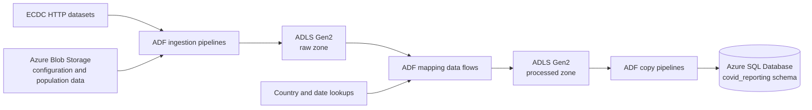

# Azure COVID-19 Data Pipeline

An Azure Data Factory (ADF) project that ingests public COVID-19 and population data, transforms it in Azure Data Lake Storage Gen2, and loads curated datasets into Azure SQL Database.

The repository contains the source-controlled ADF resources and generated ARM templates needed to deploy the factory. It does not include source data, database DDL, or cloud credentials. Azure services are accessed with the Data Factory managed identity, so no secrets are required in source control.

## Architecture



## What the project does

- Uses a configuration file in Blob Storage to ingest multiple ECDC datasets over HTTP.
- Validates and copies compressed population data from Blob Storage into ADLS Gen2.
- Transforms cases, deaths, and hospital-admission data with ADF mapping data flows.
- Enriches records with country codes, population data, and calendar dates.
- Produces daily and weekly hospital-admission datasets.
- Loads processed cases and deaths, daily hospital admissions, and testing data into Azure SQL Database.
- Supports both scheduled ECDC ingestion and event-driven population ingestion.

## Data flow

### Ingestion

| Pipeline | Purpose |
| --- | --- |
| `pl_ingest_ecdc_data` | Reads `ecdc_file_list.json`, downloads each configured ECDC CSV over HTTP, and writes it to the ADLS `raw/ecdc` area. |
| `pl_ingest_popuation_data` | Waits for `population_by_age.tsv.gz`, validates its 13-column structure, copies it to `raw/population/population_by_age.tsv`, and deletes the source object after a successful copy. |

### Transformation

| Pipeline | Mapping data flow | Output |
| --- | --- | --- |
| `pl_processed_cases_and_deaths_data` | `df_transform_cases_deaths` | Filters European records, pivots case/death indicators, enriches country codes, and writes `processed/ecdc/cases_deaths`. |
| `pl_processed_hospital_admissions` | `df_transform_hospital_admissions` | Separates daily and weekly measures, joins country and date lookups, pivots occupancy metrics, and writes daily and weekly processed datasets. |

### SQL loading

| Pipeline | Destination table |
| --- | --- |
| `pl_sqlize_cases_and_deaths` | `covid_reporting.cases_and_deaths` |
| `pl_sqlize_hospital_admissions_daily_data` | `covid_reporting.hospital_admissions_daily` |
| `pl_sqlize_testing` | `covid_reporting.testing` |

The hospital-admissions and testing loaders truncate their destination tables before inserting refreshed data. The cases-and-deaths loader currently inserts without a configured pre-copy truncate operation.

## Repository layout

```text
.
├── .github/workflows/           # CI: secret scanning (Gitleaks) and JSON validation
├── dataflow/                    # ADF mapping data flows
├── dataset/                     # HTTP, Blob, ADLS, and Azure SQL datasets
├── deploy/                      # Placeholder-only example ARM parameter file
├── factory/                     # Data Factory definition (system-assigned identity)
├── linkedService/               # External service connections (managed identity, no secrets)
├── pipeline/                    # Ingestion, transformation, and loading pipelines
├── trigger/                     # Schedule and Blob event triggers
├── vishal-covid-reporting-adf/  # Generated ARM deployment templates
├── .gitleaks.toml               # Secret-scanner configuration
├── arm-template-parameters-definition.json  # ADF custom ARM parameterization
└── publish_config.json          # ADF publish-branch configuration
```

## Prerequisites

To deploy and run the project, you need:

- An Azure subscription and resource group
- An Azure Data Factory instance with a **system-assigned managed identity** enabled (the default for new factories)
- Azure Blob Storage (general-purpose v2) for configuration and population source files
- Azure Data Lake Storage Gen2 with `raw`, `processed`, and `lookup` file systems
- Azure SQL Database with a Microsoft Entra administrator configured, a `covid_reporting` schema, and the three destination tables listed above
- The Event Grid resource provider registered in the subscription (required by the Blob event trigger)
- Azure CLI if deploying from the command line

All environment-specific values in this repository are placeholders such as `<blob-storage-account>`. Supply real values only at deployment time, through a local parameter file that is never committed.

## Required storage objects

The pipelines expect the following objects to exist before execution:

| Storage area | Path | Purpose |
| --- | --- | --- |
| Blob Storage | `configs/ecdc_file_list.json` | Metadata-driven list of ECDC source URLs and destination filenames |
| Blob Storage | `population/population_by_age.tsv.gz` | Population source file consumed by the Blob event pipeline |
| ADLS `lookup` | `dim_country/country_lookup.csv` | Country-code and population enrichment |
| ADLS `lookup` | `dim_date/dim_date.csv` | Calendar lookup used by hospital-admission transformations |

The repository defines processed testing and SQL testing datasets, but it does not contain the upstream transformation that creates the processed testing file.

## Authentication design

No linked service in this repository stores a credential. Azure services are accessed with the Data Factory **system-assigned managed identity**, and access is controlled with Azure RBAC and SQL database permissions.

| Linked service | Connector | Authentication | Stored in Git |
| --- | --- | --- | --- |
| `ls_ablob_covidreporting_sa` | Azure Blob Storage (`AzureBlobStorage`) | System-assigned managed identity (`serviceEndpoint` + `accountKind`) | Endpoint placeholder only |
| `ls_adls_covidreporting_dl` | ADLS Gen2 (`AzureBlobFS`) | System-assigned managed identity (`url` only) | Endpoint placeholder only |
| `ls_sql_covid_db` | Azure SQL Database, recommended version (`AzureSqlDatabase`) | `authenticationType: SystemAssignedManagedIdentity` | Server and database placeholders only |
| `ls_http_opendata_ecdc_europe_eu` | HTTP (`HttpServer`) | Anonymous (public ECDC open data) | Parameterized base URL, no credential |

The factory definition declares `"identity": {"type": "SystemAssigned"}` only. Azure generates the `principalId` and `tenantId` at creation time, so they are not stored in the repository.

### Azure Key Vault policy

Every current connector supports managed identity, so the project does **not** include a Key Vault linked service. Adding an unused one would only create another resource to secure.

If a future connector cannot use managed identity (for example, a third-party API key), follow this pattern instead of committing a credential or an ADF `encryptedCredential`:

1. Create a Key Vault that uses the Azure RBAC permission model.
2. Grant the Data Factory managed identity **Key Vault Secrets User** on that vault, or on the individual secret for narrower scope. Do not grant Key Vault Administrator or Secrets Officer.
3. Add an `AzureKeyVault` linked service whose `baseUrl` is `https://<key-vault-name>.vault.azure.net/`. `arm-template-parameters-definition.json` already exposes `baseUrl` as a deployment parameter with no default.
4. Reference the secret from the other linked service:

```json
"password": {
    "type": "AzureKeyVaultSecret",
    "store": { "referenceName": "<key-vault-linked-service>", "type": "LinkedServiceReference" },
    "secretName": "<secret-name>"
}
```

## Deployment

### 1. Create the factory

The generated ARM templates deploy the factory's child resources, such as linked services, datasets, pipelines, data flows, and triggers. They do not create the factory itself. Create the factory first in the Azure portal or with `az datafactory create`, and confirm that its system-assigned managed identity is enabled.

### 2. Provide the deployment parameters

Copy the placeholder example to a local file. Files matching `*.local.json` are ignored by Git.

```bash
cp deploy/ARMTemplateParametersForFactory.example.json deploy/ARMTemplateParametersForFactory.local.json
```

| Parameter | Example format | Notes |
| --- | --- | --- |
| `factoryName` | `<data-factory-name>` | Name of the existing factory |
| `ls_ablob_covidreporting_sa_serviceEndpoint` | `https://<blob-storage-account>.blob.core.windows.net/` | Blob Storage endpoint |
| `ls_adls_covidreporting_dl_url` | `https://<adls-storage-account>.dfs.core.windows.net/` | ADLS Gen2 DFS endpoint |
| `ls_sql_covid_db_server` | `<sql-server-name>.database.windows.net` | Logical SQL server FQDN |
| `ls_sql_covid_db_database` | `<sql-database-name>` | Target database |
| `tr_ingest_population_data_scope` | `/subscriptions/<subscription-id>/resourceGroups/<resource-group>/providers/Microsoft.Storage/storageAccounts/<blob-storage-account>` | Resource ID of the Blob account watched by the event trigger |

None of these values is a secret, and no secure parameter is required. The template intentionally provides no defaults for them, so a deployment fails fast if any value is missing.

> **Warning:** Never commit a populated parameter file. Keep real values in `*.local.json` files, pipeline variables, or your CI/CD system's secret or variable store.

### 3. Deploy

```bash
az deployment group create \
  --resource-group <resource-group> \
  --template-file vishal-covid-reporting-adf/ARMTemplateForFactory.json \
  --parameters @deploy/ARMTemplateParametersForFactory.local.json
```

Triggers deploy in the `Stopped` state. Start them after completing the access configuration below.

### ADF Studio and Git integration

`arm-template-parameters-definition.json` controls which properties ADF Studio parameterizes when it publishes ARM templates. It exposes storage endpoints, SQL server and database names, the Key Vault URL, and the event-trigger scope without default values, and it turns any future `connectionString`, `sasUri`, or `sasToken` into a Key Vault or secure-string parameter.

When you connect a real factory to Git, ADF writes the real endpoint values into the linked-service JSON and the generated parameter file. Do that in a private fork or branch. Before merging into this public repository, restore the placeholders and run the secret scanner.

## Required access (least privilege)

### Data Factory managed identity: storage

Assign roles at **container (file system) scope**, not account or subscription scope. These roles are based on what the pipelines actually do:

| Account | Container / file system | Operations | Role |
| --- | --- | --- | --- |
| Blob | `configs` | Lookup reads `ecdc_file_list.json` | Storage Blob Data Reader |
| Blob | `population` | Validation, Get Metadata, Copy source, **Delete** after copy | Storage Blob Data Contributor |
| ADLS Gen2 | `raw` | Copy sink (ingestion); data flow source | Storage Blob Data Contributor |
| ADLS Gen2 | `processed` | Data flow sink; SQL-load copy source | Storage Blob Data Contributor |
| ADLS Gen2 | `lookup` | Data flow lookups (country, date) | Storage Blob Data Reader |

```bash
ADF_PRINCIPAL_ID=$(az resource show \
  --resource-group <resource-group> \
  --resource-type Microsoft.DataFactory/factories \
  --name <data-factory-name> \
  --query identity.principalId -o tsv)

BLOB_ID=$(az storage account show -g <resource-group> -n <blob-storage-account> --query id -o tsv)
ADLS_ID=$(az storage account show -g <resource-group> -n <adls-storage-account> --query id -o tsv)

assign() { # role, scope
  az role assignment create --assignee-object-id "$ADF_PRINCIPAL_ID" \
    --assignee-principal-type ServicePrincipal --role "$1" --scope "$2"
}
assign "Storage Blob Data Reader"      "$BLOB_ID/blobServices/default/containers/configs"
assign "Storage Blob Data Contributor" "$BLOB_ID/blobServices/default/containers/population"
assign "Storage Blob Data Contributor" "$ADLS_ID/blobServices/default/containers/raw"
assign "Storage Blob Data Contributor" "$ADLS_ID/blobServices/default/containers/processed"
assign "Storage Blob Data Reader"      "$ADLS_ID/blobServices/default/containers/lookup"
```

Storage notes:

- Keep `accountKind` set to `StorageV2`. Managed identity isn't supported in data flows when `accountKind` is empty or `Storage`.
- If a storage firewall is enabled, either use a managed virtual network and private endpoints or enable **Allow trusted Microsoft services**. The trusted-services exception works only with managed-identity authentication.
- Consider disabling shared-key access (`allowSharedKeyAccess=false`) on both accounts once the pipelines run successfully with managed identity.

### Deploying user or pipeline identity

| Scope | Permission | Why |
| --- | --- | --- |
| Data Factory | Data Factory Contributor | Deploy linked services, datasets, pipelines, data flows, and triggers |
| Blob storage account | `Microsoft.EventGrid/eventSubscriptions/write`, for example **EventGrid EventSubscription Contributor** | Create the storage event trigger's Event Grid subscription |
| Storage containers | Role Based Access Control Administrator (constrained to the Storage Blob Data roles) or User Access Administrator, **one-time** | Create the role assignments above |

The Data Factory managed identity itself needs no Event Grid permission.

### Azure SQL Database

1. Configure a Microsoft Entra administrator on the logical server. Microsoft Entra-only authentication is recommended; the pipelines no longer need SQL authentication.
2. Allow network access from Data Factory. Use a managed virtual network with private endpoints, or enable **Allow Azure services and resources to access this server**.
3. Connected to the database as the Entra administrator, create a contained user for the factory's managed identity. The user name is the factory name. Grant only the table-level permissions the pipelines use:

```sql
CREATE USER [<data-factory-name>] FROM EXTERNAL PROVIDER;

-- Copy activity (bulk insert) sink: INSERT, plus SELECT so the copy
-- activity can read the destination table's column metadata.
GRANT SELECT, INSERT ON OBJECT::covid_reporting.cases_and_deaths         TO [<data-factory-name>];
GRANT SELECT, INSERT ON OBJECT::covid_reporting.hospital_admissions_daily TO [<data-factory-name>];
GRANT SELECT, INSERT ON OBJECT::covid_reporting.testing                  TO [<data-factory-name>];

-- The pre-copy script runs TRUNCATE TABLE, which requires ALTER on the table.
GRANT ALTER ON OBJECT::covid_reporting.hospital_admissions_daily TO [<data-factory-name>];
GRANT ALTER ON OBJECT::covid_reporting.testing                   TO [<data-factory-name>];
```

Do **not** add the identity to `db_owner`, `db_ddladmin`, or even `db_datawriter`. Grant permissions on these three tables only.

#### The `TRUNCATE TABLE` tradeoff

`TRUNCATE TABLE` requires `ALTER` on the table. That permission also allows the identity to change the table's schema, such as adding or dropping columns, which is more than a loader needs. The grants above preserve the current pipeline behavior and limit `ALTER` to the two truncated tables. A tighter design, recommended as a follow-up, wraps the truncate in an owner-signed stored procedure:

```sql
CREATE PROCEDURE covid_reporting.usp_reset_hospital_admissions_daily
WITH EXECUTE AS OWNER
AS
BEGIN
    SET NOCOUNT ON;
    TRUNCATE TABLE covid_reporting.hospital_admissions_daily;
END;
GO
GRANT EXECUTE ON OBJECT::covid_reporting.usp_reset_hospital_admissions_daily TO [<data-factory-name>];
REVOKE ALTER ON OBJECT::covid_reporting.hospital_admissions_daily FROM [<data-factory-name>];
```

After that, set the copy activity's `preCopyScript` to `EXEC covid_reporting.usp_reset_hospital_admissions_daily;`, and repeat the pattern for `testing`. Another option is to load into a staging table and swap it into place inside a stored procedure. Either way, the identity can only empty the table and cannot alter its structure. These pipeline changes are not applied in this repository, which keeps the current behavior.

`pl_sqlize_cases_and_deaths` appends rows without a pre-copy truncate. Its activity description mentions `TRUNCATE TABLE`, but no truncate is configured. Rerunning it therefore creates duplicate rows. Handle this with the same stored-procedure pattern if needed. Don't grant broader permissions to work around it.

## Triggers

| Trigger | Type | Behavior |
| --- | --- | --- |
| `tr_ingest_ecdc_data` | Schedule | Runs `pl_ingest_ecdc_data` once per day. |
| `tr_ingest_population_data` | Blob event | Runs `pl_ingest_popuation_data` when the configured population source object arrives. |

Review trigger start times, storage scopes, and enabled states before activating them in a new environment.

## Running and monitoring

1. Complete the access configuration above, then confirm that linked-service connections succeed in ADF Studio.
2. Add the required configuration and lookup files to storage.
3. Run ingestion pipelines and verify files in the ADLS raw zone.
4. Run transformation pipelines and inspect the processed outputs.
5. Run SQL-loading pipelines and validate row counts in the destination tables.
6. Use the ADF Monitor hub to inspect activity runs, mapping-data-flow diagnostics, and failures.

Pipeline and path names are preserved from the original ADF project, including `pl_ingest_popuation_data` and `hospitak_admissions_daily`. Rename them only after updating every dependent dataset, pipeline, trigger, and deployment artifact.

## Security

### Scanning for secrets locally

The repository ships a [Gitleaks](https://github.com/gitleaks/gitleaks) configuration (`.gitleaks.toml`). It extends the default ruleset with Azure and ADF-specific rules, including `encryptedCredential`, storage account keys, SAS signatures, connection-string passwords and user IDs, literal `SecureString` values, subscription IDs, and generated principal and tenant IDs.

```bash
# Install: https://github.com/gitleaks/gitleaks#installing (e.g. `brew install gitleaks`)
gitleaks dir . --config .gitleaks.toml --redact     # current working tree
gitleaks git . --config .gitleaks.toml --redact     # entire Git history
```

Always use `--redact` so findings never print secret values. The `security-scan` GitHub Actions workflow runs both scans and validates all JSON files on every push and pull request.

### Public repository security checklist

- [ ] No `encryptedCredential`, `connectionString`, `accountKey`, `sasUri`, `sasToken`, or password properties in any linked service
- [ ] Blob, ADLS Gen2, and Azure SQL linked services use the Data Factory managed identity
- [ ] `factory/*.json` declares `SystemAssigned` identity without `principalId` or `tenantId`
- [ ] Endpoints, server and database names, and the trigger scope are placeholders in Git and parameters at deployment time
- [ ] No populated parameter file is tracked (`git ls-files '*.local.json'` returns nothing)
- [ ] `gitleaks dir` **and** `gitleaks git` report no leaks
- [ ] Any credential that was ever committed, even encrypted, has been rotated or its resource deleted
- [ ] Git history has been cleaned if it contains environment identifiers or credentials
- [ ] Storage and SQL access follow the least-privilege tables above; no `db_owner`
- [ ] GitHub secret scanning and push protection are enabled in the repository settings

## License

No license file is currently included. Add one before redistributing or reusing the project outside its intended context.
