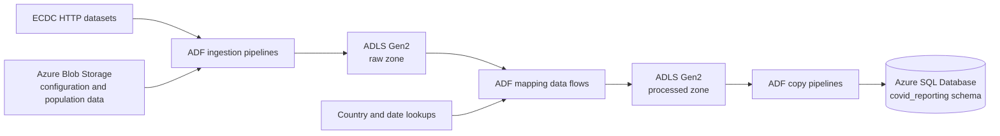

# Azure COVID-19 Data Pipeline

An Azure Data Factory (ADF) project that ingests public COVID-19 and population data, transforms it in Azure Data Lake Storage Gen2, and loads curated datasets into Azure SQL Database.

The repository contains the source-controlled ADF resources and generated ARM templates needed to deploy the factory. It does not include source data, database DDL, or cloud credentials.

## Architecture



## What the project does

- Uses a configuration file in Blob Storage to ingest multiple ECDC datasets over HTTP.
- Validates and copies compressed population data from Blob Storage into ADLS Gen2.
- Transforms cases, deaths, and hospital-admission data with ADF mapping data flows.
- Enriches records with country codes, population data, and calendar dates.
- Produces daily and weekly hospital-admission datasets.
- Loads processed cases and deaths, daily hospital admissions, and testing data into Azure SQL Database.
- Supports both scheduled ECDC ingestion and event-driven population ingestion.

## Data flow

### Ingestion

| Pipeline | Purpose |
| --- | --- |
| `pl_ingest_ecdc_data` | Reads `ecdc_file_list.json`, downloads each configured ECDC CSV over HTTP, and writes it to the ADLS `raw/ecdc` area. |
| `pl_ingest_popuation_data` | Waits for `population_by_age.tsv.gz`, validates its 13-column structure, copies it to `raw/population/population_by_age.tsv`, and deletes the source object after a successful copy. |

### Transformation

| Pipeline | Mapping data flow | Output |
| --- | --- | --- |
| `pl_processed_cases_and_deaths_data` | `df_transform_cases_deaths` | Filters European records, pivots case/death indicators, enriches country codes, and writes `processed/ecdc/cases_deaths`. |
| `pl_processed_hospital_admissions` | `df_transform_hospital_admissions` | Separates daily and weekly measures, joins country and date lookups, pivots occupancy metrics, and writes daily and weekly processed datasets. |

### SQL loading

| Pipeline | Destination table |
| --- | --- |
| `pl_sqlize_cases_and_deaths` | `covid_reporting.cases_and_deaths` |
| `pl_sqlize_hospital_admissions_daily_data` | `covid_reporting.hospital_admissions_daily` |
| `pl_sqlize_testing` | `covid_reporting.testing` |

The hospital-admissions and testing loaders truncate their destination tables before inserting refreshed data. The cases-and-deaths loader currently inserts without a configured pre-copy truncate operation.

## Repository layout

```text
.
├── dataflow/                    # ADF mapping data flows
├── dataset/                     # HTTP, Blob, ADLS, and Azure SQL datasets
├── factory/                     # Data Factory definition
├── linkedService/               # External service connections
├── pipeline/                    # Ingestion, transformation, and loading pipelines
├── trigger/                     # Schedule and Blob event triggers
├── vishal-covid-reporting-adf/  # Generated ARM deployment templates
└── publish_config.json          # ADF publish-branch configuration
```

## Prerequisites

To deploy and run the project, you need:

- An Azure subscription and resource group
- Azure Data Factory
- Azure Blob Storage for configuration and population source files
- Azure Data Lake Storage Gen2 with `raw`, `processed`, and `lookup` file systems
- Azure SQL Database with a `covid_reporting` schema and the three destination tables listed above
- Permissions for ADF to read and write the storage resources and connect to Azure SQL Database
- Azure CLI if deploying from the command line

The storage account names, URLs, and event-trigger scope in the checked-in templates reflect the original environment. Replace them with values for your own Azure resources.

## Required storage objects

The pipelines expect the following objects to exist before execution:

| Storage area | Path | Purpose |
| --- | --- | --- |
| Blob Storage | `configs/ecdc_file_list.json` | Metadata-driven list of ECDC source URLs and destination filenames |
| Blob Storage | `population/population_by_age.tsv.gz` | Population source file consumed by the Blob event pipeline |
| ADLS `lookup` | `dim_country/country_lookup.csv` | Country-code and population enrichment |
| ADLS `lookup` | `dim_date/dim_date.csv` | Calendar lookup used by hospital-admission transformations |

The repository defines processed testing and SQL testing datasets, but it does not contain the upstream transformation that creates the processed testing file.

## Deployment

### Configure the ARM parameters

Copy and update:

```text
vishal-covid-reporting-adf/ARMTemplateParametersForFactory.json
```

At minimum, provide environment-specific values for:

- `factoryName`
- `ls_ablob_covidreporting_sa_connectionString`
- `ls_adls_covidreporting_dl_accountKey`
- `ls_sql_covid_db_connectionString`
- `ls_adls_covidreporting_dl_properties_typeProperties_url`
- `tr_ingest_population_data_properties_typeProperties_scope`

Do not commit populated connection strings, account keys, or other secrets. Prefer Azure Key Vault-backed linked services for long-lived environments.

### Deploy the factory

After signing in with Azure CLI, deploy the generated ARM template:

```bash
az deployment group create \
  --resource-group <resource-group> \
  --template-file vishal-covid-reporting-adf/ARMTemplateForFactory.json \
  --parameters @vishal-covid-reporting-adf/ARMTemplateParametersForFactory.json
```

You can also connect the repository to ADF Studio and work with the JSON resources directly. The configured publish branch is `main`.

## Triggers

| Trigger | Type | Behavior |
| --- | --- | --- |
| `tr_ingest_ecdc_data` | Schedule | Runs `pl_ingest_ecdc_data` once per day. |
| `tr_ingest_population_data` | Blob event | Runs `pl_ingest_popuation_data` when the configured population source object arrives. |

Review trigger start times, storage scopes, and enabled states before activating them in a new environment.

## Running and monitoring

1. Confirm that linked-service connections succeed in ADF Studio.
2. Add the required configuration and lookup files to storage.
3. Run ingestion pipelines and verify files in the ADLS raw zone.
4. Run transformation pipelines and inspect the processed outputs.
5. Run SQL-loading pipelines and validate row counts in the destination tables.
6. Use the ADF Monitor hub to inspect activity runs, mapping-data-flow diagnostics, and failures.

Pipeline and path names are preserved from the original ADF project, including `pl_ingest_popuation_data` and `hospitak_admissions_daily`. Rename them only after updating every dependent dataset, pipeline, trigger, and deployment artifact.

## Security notes

- Keep secrets out of Git and deployment parameter files.
- Use managed identities and Azure Key Vault where possible.
- Restrict storage and database access to the minimum permissions required by ADF.
- Treat the checked-in resource identifiers as examples from the original environment and replace them before deployment.

## License

No license file is currently included. Add one before redistributing or reusing the project outside its intended context.
